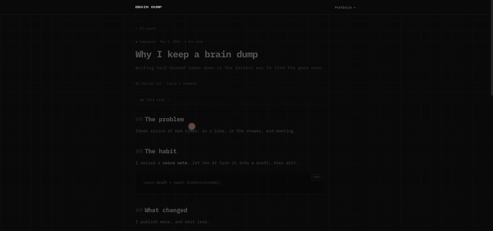
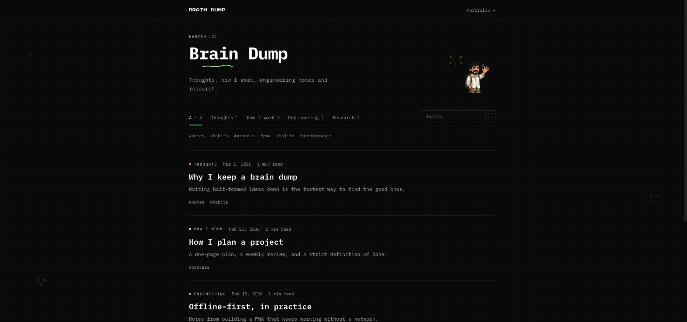
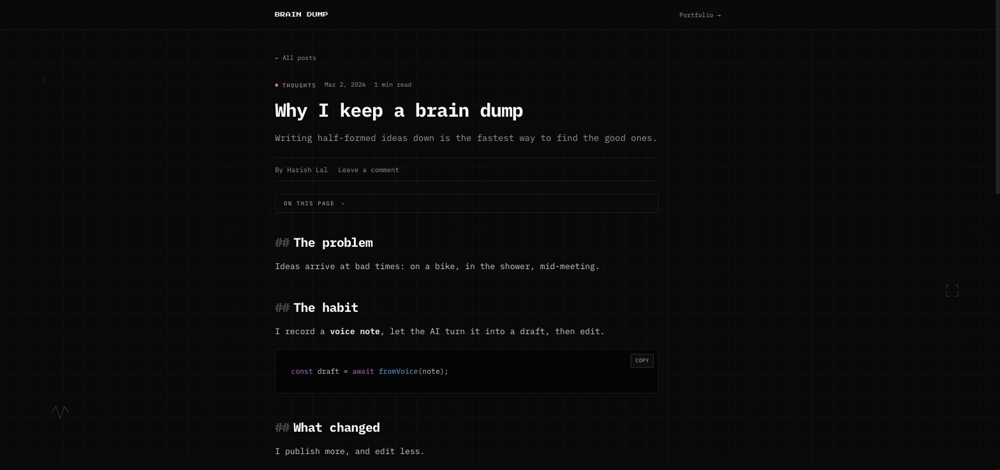
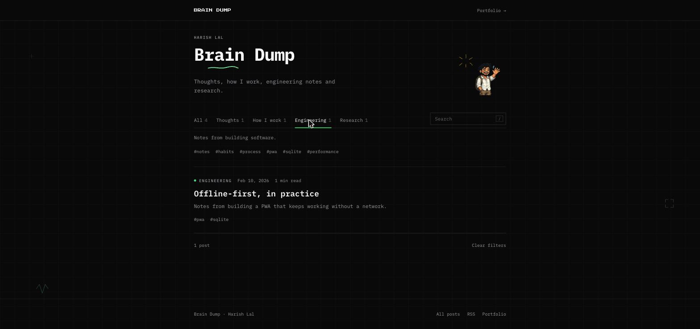

# Brain Dump

The blog behind the portfolio: thoughts, how I work, engineering notes and research. It lives at
`/blog` on the portfolio (the portfolio proxies to this app) and can also run on its own.

Write a post by voice, from rough notes, or from a blank page. An AI pass turns voice/notes into a
draft; you edit it, add media, and publish.



**Contents:** [Features](#whats-in-it) · [Screenshots](#screenshots) · [Tech stack](#tech-stack) · [Getting started](#run-it) · [Writing a post](#writing-a-post) · [Data and storage](#data-and-storage) · [Deployment](#deployment) · [API](#api-overview) · [Architecture](#how-its-built) · [Performance](#performance) · [Security](#security) · [Configuration notes](#configuration-notes) · [Troubleshooting](#troubleshooting)

## What's in it

**Reading**
- Feed with categories (Thoughts, How I work, Engineering, Research), tag filters, search (press `/`), and "load more"
- Post pages built for reading: one column, an "On this page" outline, heading deep links, copy buttons on code, reading progress
- Threaded comments (with a remembered name), one-tap reactions, share/copy link, related posts
- RSS (`/blog/rss.xml`) and a sitemap; per-post titles/descriptions for link previews

**Writing (admin at `/blog/admin`)**
- Voice or text to draft, blank drafts, and a markdown editor with live preview and shortcuts (Ctrl/Cmd+S)
- Media: upload, drag-and-drop or paste photos, video and PDFs; cover images; YouTube/Vimeo embeds
- Dashboard with views, comment counts, publishing and comment moderation
- Installable as an app (voice notes from a phone)

## Screenshots

| Feed | Post page |
| --- | --- |
|  |  |



*Captured locally with sample posts.*

## Tech stack

- **Client:** React 18, React Router 6, Vite 5, Tailwind CSS 3
- **Server:** Node.js + Express 4 (helmet, compression, express-rate-limit, bcryptjs, jsonwebtoken, gray-matter)
- **Storage:** plain files on disk (markdown posts + JSON), no database
- **AI drafting:** OpenAI (optional)
- **Hosting:** Docker on Fly.io

## Run it

**Prerequisites:** Node.js 20+ and npm (the Docker image uses `node:20-alpine`). An OpenAI key is only
needed for voice/text drafting.

In development the app is served under `/blog/` (the Vite `base`), so open `http://localhost:5173/blog/`
and the admin at `http://localhost:5173/blog/admin`. If `ADMIN_PASSWORD` is unset in dev, login is disabled,
and an unset `JWT_SECRET` gets a random per-run value (sessions reset on restart).

```bash
npm run install:all
cp server/.env.example server/.env    # then fill it in
npm run dev                            # API on :3001, client on :5173 (open /blog/)
```

Production: `npm run build && npm start` (see the `Dockerfile` and `fly.toml`).

### Environment variables (`server/.env`)

| Variable | Required | Purpose |
| --- | --- | --- |
| `JWT_SECRET` | production | 32+ random chars (`openssl rand -hex 32`); signs admin tokens |
| `ADMIN_PASSWORD` | production | 8+ chars; the admin login |
| `OPENAI_API_KEY` | no | Enables voice/text to draft; blank drafts work without it |
| `PORT` | no | Server port (default `3001`) |
| `DATA_DIR` | no | Where posts, uploads, comments and analytics live (a mounted volume in production) |
| `SITE_URL` | no | Public origin used in RSS/sitemap links |
| `TRUST_PROXY` | no | Number of reverse proxies in front (default `2`) |

### Scripts

| Command | What it does |
| --- | --- |
| `npm run install:all` | Installs root, server and client dependencies |
| `npm run dev` | API (`:3001`) and Vite client (`:5173`) together |
| `npm run build` | Production client build |
| `npm start` | Serves the API and the built client |

## Writing a post

1. Sign in at `/blog/admin` with `ADMIN_PASSWORD`.
2. Start a post: **voice** (record, then the AI turns it into a draft), **text** (paste rough notes), or **blank** (write it yourself; works without an OpenAI key).
3. Edit in the markdown editor with live preview. `Ctrl/Cmd+S` saves. Set a title, summary, category, tags and cover image.
4. Add media by upload, drag-and-drop or paste; paste a YouTube/Vimeo link to embed it.
5. Publish. Drafts are never visible publicly; unpublished changes can be edited any time.

Categories are `thoughts`, `how-i-work`, `engineering` and `research` (defined in `server/config.js`).

**Limits:** title 140 chars, summary 300, up to 8 tags (30 chars each), post body 200,000 chars, comment name 50 / text 2,000; uploads up to 12 MB images, 25 MB video, 15 MB PDF.

## Data and storage

There is no database. Everything lives under `DATA_DIR` (defaults to the `server/` folder in dev, `/data` on Fly):

```
DATA_DIR/
  posts/        one <slug>.md per post (YAML frontmatter + markdown body)
  uploads/      media with random filenames (images re-encoded to WebP)
  comments/     <postId>.json
  reactions/    <postId>.json
  analytics/    views.json
```

Back up by copying the directory (or snapshotting the Fly volume). A post looks like:

```markdown
---
id: 3f6c0a52-...            # UUID, generated
title: My post
summary: One-line description used in previews
tags: [notes]
category: thoughts
cover: ''
published: true
createdAt: 2026-01-01T10:00:00.000Z
updatedAt: 2026-01-01T10:00:00.000Z
slug: my-post
---
Markdown body here.
```

Hand edits are picked up within 30 seconds (the in-memory cache TTL).

## Deployment

Pushes to `main` deploy automatically to Fly.io via `.github/workflows/fly-deploy.yml` (needs the
`FLY_API_TOKEN` repository secret). `fly.toml` mounts a persistent volume at `/data`
(`DATA_DIR`), health-checks `/healthz`, and stops idle machines to save cost. Set the secrets once with
`fly secrets set JWT_SECRET=... ADMIN_PASSWORD=... OPENAI_API_KEY=...`.

## API overview

Public routes are read-only apart from comments, reactions and view hits; everything else needs the admin JWT.

| Prefix | Purpose |
| --- | --- |
| `/api/auth` | `POST /login`, `GET /verify` |
| `/api/posts` | List/read posts; admin create (`/from-voice`, `/from-text`, `/manual`), update, publish, delete; `rss.xml` and `sitemap.xml` are served from the feed router |
| `/api/comments` | Threaded comments per post; admin delete |
| `/api/reactions` | Read and add reactions |
| `/api/analytics` | View hits (public), dashboard stats (admin) |
| `/api/media` | Upload and serve images, video, PDFs |

## How it's built

```
server/
  index.js              app wiring: headers, compression, caching, SPA fallback with per-post meta
  config.js             env + limits (fails fast in production without real secrets)
  middleware/           security (CSP, rate limits), auth (JWT), validation
  routes/               posts, comments, reactions, media, auth, analytics, feed (RSS/sitemap)
  services/             postStore (cached markdown files), comments, reactions, media, analytics, ai
client/src/
  pages/                Feed, Post, admin/{Dashboard,Create,Edit,Login}
  components/           public/ (reading UI), admin/ (editor, recorder), ui/ (doodles, links, labels)
  lib/                  api (stale-while-revalidate cache), markdown (sanitizing renderer)
```

Posts are markdown files with YAML frontmatter under `DATA_DIR/posts`: easy to back up and edit by hand.

## Troubleshooting

| Symptom | Likely cause |
| --- | --- |
| Server exits with `FATAL: JWT_SECRET must be set` | Production mode needs `JWT_SECRET` (32+ chars) and `ADMIN_PASSWORD` (8+ chars) |
| Cannot log in locally | `ADMIN_PASSWORD` is unset, which disables login in dev; set it in `server/.env` |
| Voice/text drafting fails | `OPENAI_API_KEY` missing or invalid; use a blank draft instead |
| Rate limits hit too early, or everyone shares one IP | `TRUST_PROXY` doesn't match the number of proxies in front |
| Large upload fails through the portfolio | The portfolio's proxy body-size limit is too low (see configuration notes) |
| Blank page at `/` in dev | The app lives under `/blog/`, not the root |
| Posts or uploads vanish after a deploy | `DATA_DIR` isn't on a mounted volume |

## Performance

- Posts are held in memory (rebuilt on write or after 30 s), not re-parsed per request
- Feed load is ~64 KB of JavaScript; the markdown/highlighting code (~80 KB) loads only on a post page, and is warmed when you hover a link
- API responses carry `Cache-Control` + `ETag` (304s); hashed assets are `immutable` for a year; uploads are immutable
- The client caches the post list (memory + sessionStorage) and revalidates in the background, so navigation and reloads are instant
- gzip everywhere; images are re-encoded to WebP (max 1920 px) on upload; page transitions use the View Transitions API
- View counts are buffered in memory and flushed in batches

## Security

- **Uploads:** file type decided by magic bytes (never the filename or Content-Type); SVG/HTML rejected; images re-encoded (strips EXIF/GPS); random filenames; size limits per type
- **Rendering:** post HTML is sanitized with DOMPurify (allow-list), embeds limited to YouTube/Vimeo and own uploads; comments are rendered as plain text
- **Headers:** strict CSP (no inline script), HSTS, `nosniff`, `frame-ancestors 'none'`, minimal Permissions-Policy
- **Auth:** bcrypt, pinned-algorithm JWTs (12 h), brute-force limit + delay on login; the server won't start in production without `JWT_SECRET` / `ADMIN_PASSWORD`
- **Abuse:** per-route rate limits, honeypot on comments, ID/slug validation on everything that touches the filesystem, field whitelist on post updates, drafts never served to the public
- Errors return generic messages; details stay in the server log

## Configuration notes

- `SITE_URL` is used for RSS/sitemap links (the portfolio's origin, since the blog is served under `/blog`).
- `TRUST_PROXY` must match how many reverse proxies sit in front (default 2: Fly + the portfolio's rewrite); it decides which IP the rate limits see.
- The portfolio's `next.config.ts` raises the proxy's request-body limit so large uploads work through `/blog`.
- Rate limits and view buffering are in-process: fine for one machine (as on Fly); use a shared store if you scale out.
